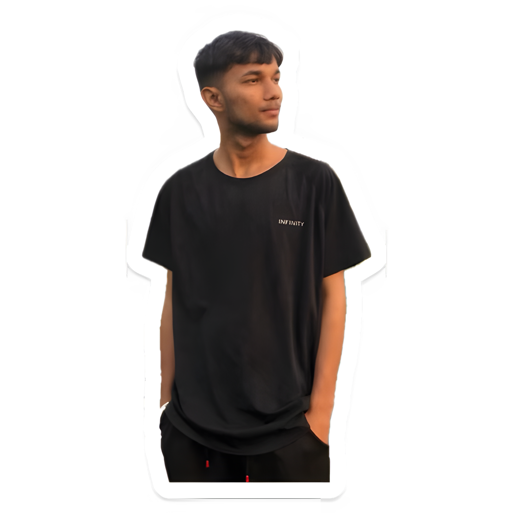

<b font-size="10">Hi, I'm Diwash Pandey,</b>a passionate Full Stack Developer specializing in React.js, JavaScript, and Python. Currently pursuing a BCA (2nd Year) with a minor in AI & Data Science, I love building interactive web applications and integrating AI to create smart solutions.  💼 Projects:  Expense Tracker App (with AI insights) To-Do List Basic Chatbots using APIs 💡 Tech Stack: React.js | Vite | JavaScript | Python | C++ | Java | HTML | CSS | Power BI | NumPy | Pandas  🌱 Currently learning: Backend Development & AI/ML 🎯 Goal: Building AI-driven web applications  📫 Let’s connect: diwashpandey999@gmail.com

  

### My Basic Skills 🤹

  
  
  
  
  
  
  
  
  
  
  
  
  
  
  
  
  
  
  
  
  
  
  
  
  
  
  

### My Stats 📊

<table>
  <tr>
    <td>
      
    </td>
    <td>
      
    </td>
  </tr>
</table>

### My Social Media 📲

  
  
  
  
  
  
  
  
  

